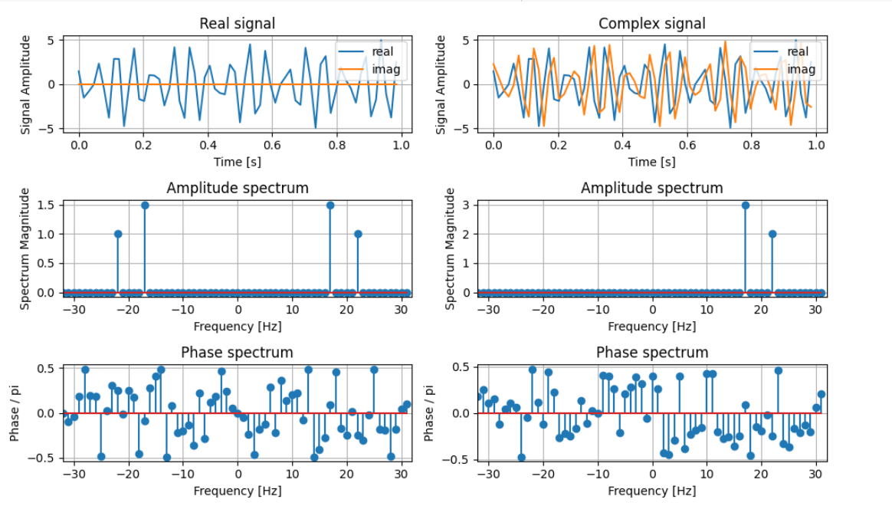

# Дискретное преобразование Фурье

### Вариант 22

``` python
# Амплитудный и фазовый частотный спектры
A1 = np.abs(X1);
A2 = np.abs(X2);
P1 = np.arctan(np.imag(X1) / (np.real(X1)+1e-6));
P2 = np.arctan(np.imag(X2) / (np.real(X2)+1e-6));
# ПРИМЕЧАНИЕ. Для того, чтобы избавиться от неопределенности типа 0/0 при вычислении фазового спектра,
# прибавим к знаменателю достаточно малое число, чтобы частное было близко к нулю, и корректно отображалось на графике.
# В противном случае, в точках с нулевыми гармониками мы будем видеть случайные значения, полученные в результате
# деления малых чисел, близких к 0, с ограниченной точностью, что не очень адекватно отразит изучаемые свойства спектров
```

Что будет с фазовым спекторм, если убрать дополнение `+1e-6`:

<p align="center" > </p>